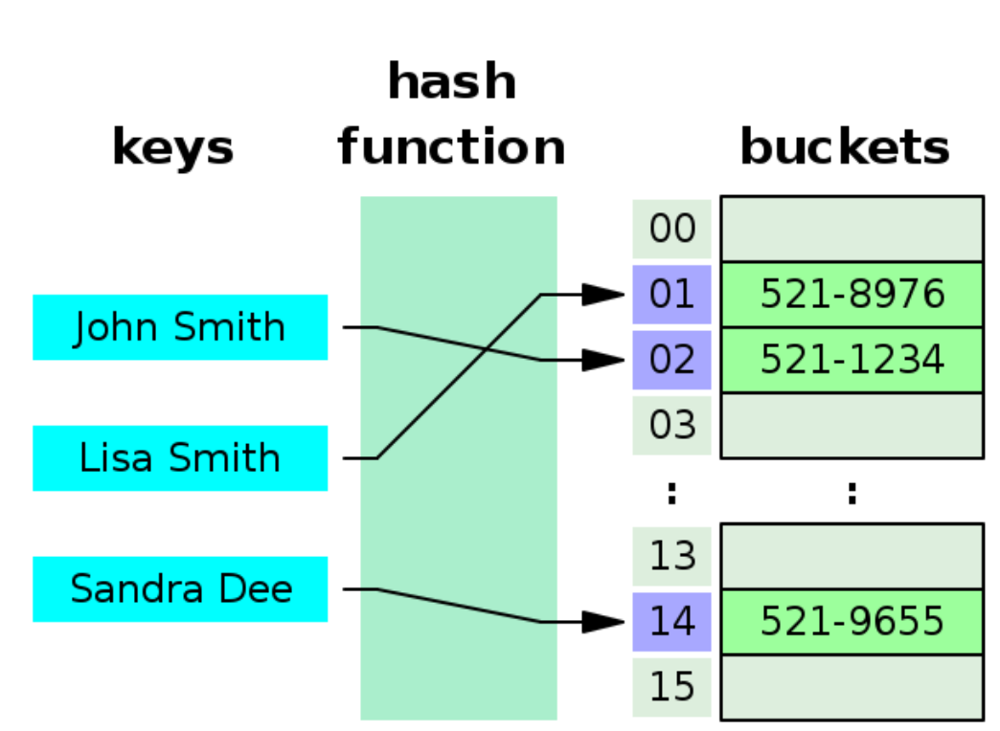
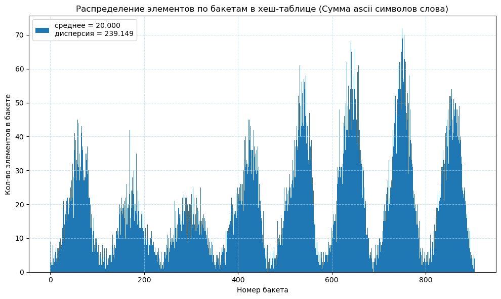
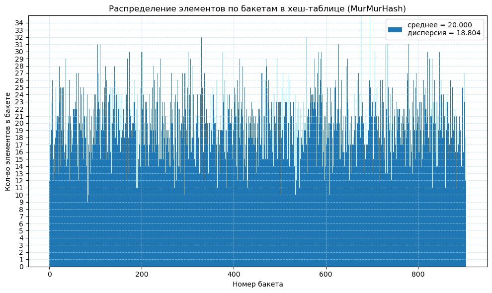
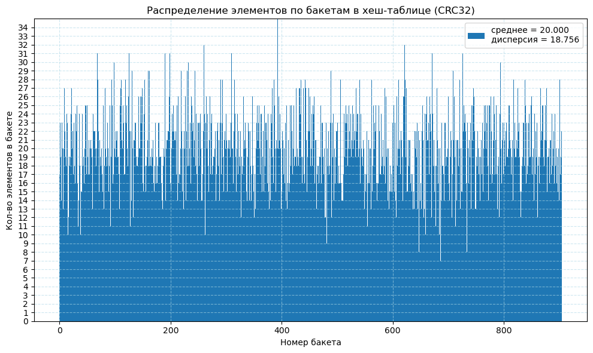

# Оптимизация [Хеш-таблицы](https://ru.wikipedia.org/wiki/%D0%A5%D0%B5%D1%88-%D1%82%D0%B0%D0%B1%D0%BB%D0%B8%D1%86%D0%B0)

## Введение
$\quad$ Меня заинтересовал вопрос создания своей хеш-таблицы и последующего ускорения её работы. 

### Что такое Хеш-таблица
* Это особый тип контейнера для данных, где храняться сами значения или пары (ключ-значение).



* Есть два основных способа представления бакетов с данными: бакет = отдельное значение, бакет = список из нескольких значений, для хеш-таблиц реализованных методом открытой адресации и методом цепочек соответственно. 

* Когда слово для поиска поступает на вход, оно обрабатывается хеш-функцией для получения хеша(номера бакетa), соответствующего данному слову. 

* В связи с неполной рандомизированностью выходных значений хеш-функции от разных входных значений и/или малыми размерами хеш-таблицы, возникает явление коллизии. Это явление, при котором нескольким входным значениям соответсвует один номер бакета.  

* Для борьбы с коллизиями будем использвать представление бакета двусвязным списком. Таким образом, элементы с одинаковым значением хеша будут накапливаться в списке. 

* В этой реализации возникает вопрос выбора хеш-функции для наиболее равномерного распределения элементов по бакетам.

### На этот момент имеем несколько задач:
>1) Создать хеш-таблицу методом цепочек
>2) Выбрать "хорошую" хеш-функцию 
>3) Ускорить функцию поиска без вставки 

## 1) Создание хеш-таблицы
Будем считать, что с эти этапом Я справился, обычная версия хеш-таблицы, без оптимизаций у меня уже есть


## 2) Анализ разных хеш-функций
> [!NOTE]
> Предисловие: все нижеописанные функции не имеют представления о размере таблицы, поэтому вызывающая функция делит с остатком возвращаемое значение хеш-функции, а остаток от деления служит номером бакета.


1. Первый вариант хеш-функции это AsciiSumHash, которая возвращает сумму ascii-кодов символов слова.
Распределение по бакетам и дисперсия (корень сренеквадратичного отклонения от среднего) для это варианта:



> [!NOTE] 
> Важное уточнение: общее количество бакетов подбирается так, чтобы load factor(среднее количество слов в бакете) был в среднем 20. Это нужно для того,
> чтобы была возможность оптимизирования функции поиска. Если бы цель была просто ускорить, мы бы увеличили размер таблицы, для исчезновения списков, но задача заключается в другом.

2. Второй вариант это MurMurHash:



Как видно, имеет гораздо лучшее распределение, но мы на этом не остановимся.

3. Третий вариант это CRC32: 



Имеет почти то же значение дисперсии, но мы выберем эту функцию с другим умыслом: у неё есть реализация в виде SIMD-инструкции, что поможет нам в оптимизации.

## 3) Оптимизации 
Для того, чтобы приступить к оптимизациям, нужно найти узкие места программы, и начинать с них. У процесса поиска таких мест есть название -- профилирование. Для профилирования будем использовать профилировщик perf. 

> [!IMPORTANT]
> Краткий список команд perf'а: 
>- сбор профиля работающей программы, где * это имя программы : 
>   - sudo perf record ./* 
>- замерение времени работы программы:
>   - sudo perf stat ./* 
>- просмотр файла профиля, собранного последней коммандой perf record:
>   - sudo perf report

Профилируем первую версию программы, получаем результат времени работы для 300 повторных поисков всех данных хеш-таблицы и список узких мест программы: 
```C
        17 107,72      msec task-clock                  #    1,000 CPUs utilized             
               51      context-switches                 #    2,981 /sec                      
               11      cpu-migrations                   #    0,643 /sec                      
            1 754      page-faults                      #    102,527 /sec                      
   75 914 920 025      cycles                           #    4,437 GHz                       
    4 488 693 203      stalled-cycles-frontend          #    5,91% frontend cycles idle      
  141 342 452 908      instructions                     #    1,86  insn per cycle            
                                                        #    0,03  stalled cycles per insn   
   17 642 784 292      branches                         #    1,031 G/sec                     
      509 810 675      branch-misses                    #    2,89% of all branches           

    17,108651614 seconds time elapsed

    17,102121000 seconds user
    0,005999000 seconds sys
```

```C
 0,00%  hashtable  hashtable             [.] _start
 0,00%  hashtable  libc.so.6             [.] __libc_start_main@@GLIBC_2.34
 0,00%  hashtable  libc.so.6             [.] __libc_start_call_main
 0,00%  hashtable  hashtable             [.] main
 2,80%  hashtable  hashtable             [.] TableSearchTest(HashTable_t*, HashTable_t*, ProgConfig*)
 3,68%  hashtable  hashtable             [.] TableSearch(HashTable_t*, HashTable_t*, char const*, int*)
64,79%  hashtable  hashtable             [.] CRC32(char const*)
11,71%  hashtable  hashtable             [.] ListFindNode(List*, char const*)
 7,24%  hashtable  libc.so.6             [.] __strcmp_avx2
 4,25%  hashtable  libc.so.6             [.] __strncpy_avx2
 1,64%  hashtable  libc.so.6             [.] __strlen_avx2
```

>Среднее время работы для одного цикла поиска всех данных, содержащихся в хеш-таблице:
>
> T = $(55.84 \pm 2.13)$ мc 

Результат оптимизации:
### Первый этап это использование ключа оптимизаций -O3: 
```C
         11 102,04      msec task-clock                  #    1,000 CPUs utilized             
                42      context-switches                 #    3,783 /sec                      
                 6      cpu-migrations                   #    0,540 /sec                      
             1 752      page-faults                      #  157,809 /sec                      
    49 297 679 362      cycles                           #    4,440 GHz                       
     3 092 195 524      stalled-cycles-frontend          #    6,27% frontend cycles idle      
    77 911 832 801      instructions                     #    1,58  insn per cycle            
                                                         #    0,04  stalled cycles per insn   
     9 472 946 306      branches                         #  853,261 M/sec                     
       387 592 035      branch-misses                    #    4,09% of all branches           

      11,102899283 seconds time elapsed

      11,097436000 seconds user
       0,004999000 seconds sys
```

```C
49,78%  hashtable  hashtable             [.] CRC32(char const*)                                       
15,26%  hashtable  libc.so.6             [.] __strcmp_avx2                                             
12,19%  hashtable  hashtable             [.] ListFindNode(List*, char const*)                          
 4,27%  hashtable  hashtable             [.] TableSearch(HashTable_t*, HashTable_t*, char const*, int*)
 5,16%  hashtable  libc.so.6             [.] __strncpy_avx2                                           
 2,52%  hashtable  libc.so.6             [.] __strlen_avx2                                           
 3,26%  hashtable  hashtable             [.] TableSearchTest(HashTable_t*, HashTable_t*, ProgConfig*)
 1,67%  hashtable  hashtable             [.] strcmp@plt                                                      
```
>Среднее время работы для одного цикла поиска всех данных, содержащихся в хеш-таблице:
>
> T = $(37.88 \pm 1.31)$ мc 

### Следующим будем оптимизировать функцию CRC32:
Перепишем функцию подсчёта хеша от входного слова. Будем использовать [интринсики](https://en.wikipedia.org/wiki/Intrinsic_function):
```C
uint32_t IntrinCRC32 (const char* word, int word_length)
{ 
    uint64_t crc_init = 0;
    memcpy(&crc_init, word, word_length);

    uint32_t key = _mm_crc32_u64(-1, crc_init);

    return key;
}
```
Пришлось разделить изначальную хеш-таблицу на две: 1) со словами длинной до 8 символов, 2) со словами длиннее. Эта функция считает хеш для слов для 1-ой таблицы. Для слов длиннее хеш расчитывается изначальной функцией CRC32. 

Результат оптимизации: 
```C
          9 593,07 msec task-clock                       #    1,000 CPUs utilized             
                48      context-switches                 #    5,004 /sec                      
                17      cpu-migrations                   #    1,772 /sec                      
             1 738      page-faults                      #  181,173 /sec                      
    42 407 496 442      cycles                           #    4,421 GHz                       
     4 052 282 924      stalled-cycles-frontend          #    9,56% frontend cycles idle      
    54 692 980 864      instructions                     #    1,29  insn per cycle            
                                                         #    0,07  stalled cycles per insn   
    11 771 524 422      branches                         #    1,227 G/sec                     
       395 446 960      branch-misses                    #    3,36% of all branches           

       9,594198352 seconds time elapsed

       9,587646000 seconds user
       0,005999000 seconds sys
```

```C
22,01%  hashtable  libc.so.6             [.] __strcmp_avx2                                                   
17,66%  hashtable  hashtable             [.] ListFindNode(List*, char const*)                                
 8,08%  hashtable  libc.so.6             [.] __strlen_avx2                                                  
 8,25%  hashtable  hashtable             [.] TableSearch(HashTable_t*, HashTable_t*, char const*, int*)      
 4,18%  hashtable  hashtable             [.] IntrinCRC32(char const*, int)                                   
 7,43%  hashtable  libc.so.6             [.] __strncpy_avx2                                                  
 0,00%  hashtable  [unknown]             [k] 0x000062040f3992a0                                              
 0,00%  hashtable  hashtable             [.] main                                                           
 6,60%  hashtable  libc.so.6             [.] __memmove_avx_unaligned_erms                                    
 5,97%  hashtable  hashtable             [.] CRC32(char const*)                                              
 4,80%  hashtable  hashtable             [.] TableSearchTest(HashTable_t*, HashTable_t*, ProgConfig*)        
 2,56%  hashtable  hashtable             [.] strcmp@plt                                                      
 2,71%  hashtable  hashtable             [.] strlen@plt                                                     
 1,71%  hashtable  libc.so.6             [.] __strncpy_chk         
```
>Среднее время работы для одного цикла поиска всех данных, содержащихся в хеш-таблице:
>
> T = $(31.45 \pm 0.76)$ мc 

### Оптимизация функции Strcmp: 
Переделаем функцию Strcmp. Для этого перепишем её на x86 ассемблере, скомпилируем nasm'ом и слинкуем с основной программой. 

Код ассемблерной функции Strcmp:

```C
section .data

section .text
    global MyStrcmp
 
MyStrcmp:
        mov     rax, rdi
        mov     rdi, rdx
        mov     edx, ecx
        vmovdqu xmm0, [rax]
        mov     eax, esi
        vpcmpestri      xmm0, [rdi], 12
        mov     eax, ecx
        ret
```

Оптимизация основывается на том, что MyStrcmp работает со словами не длиннее 16 символа. Если слово длиннее, слова сравниваются обычным strcmp. По дампу двух хеш-таблиц в csv-файл, я понял, что слов, длиннее 16 всего около 20 штук из 570 тысяч. Это значит, что branch predictor будет хорошо предсказывать ветвление программы и заметного замедления за счёт конструкции if не произойдёт. Данные взяты для романа Властелин колец, все измерения производились на нём.   

Также, как и в прошлом пункте, пришлось разделить таблицу на две. Пришлось также подкорректировать код оптимизированной функции CRC32, теперь она считает хеш для слов длинной до 16 символов:

```C
uint32_t IntrinCRC32 (const char* word, int word_length)
{ 
    uint64_t crc_init[2] = {0};
    memcpy(crc_init, word, word_length);  
    
    uint32_t key = _mm_crc32_u64(-1, crc_init[0]);
    key += _mm_crc32_u64(-1, crc_init[1]);

    return key;
}
```

Результат оптимизации:
```C
      9 086,10 msec task-clock                          #    1,000 CPUs utilized             
            45      context-switches                    #    4,953 /sec                      
             4      cpu-migrations                      #    0,440 /sec                      
         1 736      page-faults                         #  191,061 /sec                      
40 345 302 963      cycles                              #    4,440 GHz                       
 2 552 395 672      stalled-cycles-frontend             #    6,33% frontend cycles idle      
43 704 537 579      instructions                        #    1,08  insn per cycle            
                                                        #    0,06  stalled cycles per insn   
 9 762 597 411      branches                            #    1,074 G/sec                     
   325 784 012      branch-misses                       #    3,34% of all branches           

   9,086873566 seconds time elapsed

   9,081333000 seconds user
   0,004999000 seconds sys    
```

```C
30,22%  hashtable  hashtable             [.] FastListFindNode(List*, int, char const*, int)                 
10,82%  hashtable  hashtable             [.] TableSearch(HashTable_t*, HashTable_t*, char const*, int*)     
 6,34%  hashtable  libc.so.6             [.] __strlen_avx2                                                  
 1,76%  hashtable  hashtable             [.] MyStrcmp                                                       
 6,44%  hashtable  hashtable             [.] IntrinCRC32(char const*, int)                                  
 8,91%  hashtable  libc.so.6             [.] __memmove_avx_unaligned_erms                                   
 8,90%  hashtable  libc.so.6             [.] __strncpy_avx2                                                 
 0,00%  hashtable  [unknown]             [k] 0x00005d902e4052a0                                             
 0,00%  hashtable  hashtable             [.] main                                                           
 5,22%  hashtable  hashtable             [.] TableSearchTest(HashTable_t*, HashTable_t*, ProgConfig*) 
```
>Среднее время работы для одного цикла поиска всех данных, содержащихся в хеш-таблице:
>
> T = $(30.25 \pm 0.21)$ мc 

### Изменение цикла поиска и небольшие корректировки работы с переменными: 
Я заметил, что некоторые циклы в моей программе устроены по глупому и замедляют программу. Основная идея в том, чтобы использовать цикл for по известному количеству итераций, вместо цикла while(1) с лишними проверками. Пример такого изменения в функции поиска по бакету:

<details>

<summary>Было:</summary>

```C
    int FastListFindNode (List_t* list, const char* string, int str_len)
    {
        List_t* tmp_node = list->next;
        List_t* next_node = nullptr;
        int iter = 0;

        while (1)
        {   
            next_node = tmp_node->next;

            if (next_node)
            {
                if (tmp_node != list)
                {
                    if ( (str_len == tmp_node->str_len) && 
                        (!MyStrcmp(GET_NODE_DATA(tmp_node), tmp_node->str_len, string, str_len)) )
                    {
                        return iter;
                    }
                    else  
                    {
                        tmp_node = next_node;
                        iter++;
                    }
                }
                else  
                {
                    return -1;
                }
            }
            else  
            {
                printf("Bad list allocation");
                exit(1);
            }
        }

        return -1;
    }
```
</details>

<details>
<summary>Стало:</summary>

```C
int FastListFindNode (List_t* list, int list_size, const char* string, int str_len)
{
    List_t* tmp_node = list->next;
    List_t* next_node = nullptr;
    int iter = 0;

    for (int i = 0; i < list_size; i++)
    {   
        next_node = tmp_node->next;

        if ( (str_len == tmp_node->str_len) && 
             (!MyStrcmp(GET_NODE_DATA(tmp_node), tmp_node->str_len, string, str_len)) )
        {
            return iter;
        }
        else  
        {
            tmp_node = next_node;
            iter++;
        }
    }

    return -1;
}
```
</details>


Результат оптимизации:
```C
          7 149,04 msec task-clock                       #    0,999 CPUs utilized             
               406      context-switches                 #   56,791 /sec                      
                13      cpu-migrations                   #    1,818 /sec                      
             1 738      page-faults                      #  243,110 /sec                      
    31 693 805 878      cycles                           #    4,433 GHz                       
     2 362 090 127      stalled-cycles-frontend          #    7,45% frontend cycles idle      
    37 612 993 293      instructions                     #    1,19  insn per cycle            
                                                         #    0,06  stalled cycles per insn   
     8 205 095 887      branches                         #    1,148 G/sec                     
       294 718 735      branch-misses                    #    3,59% of all branches           

       7,157076956 seconds time elapsed

       7,134149000 seconds user
       0,015025000 seconds sys
```

```C
31,19%  hashtable  hashtable             [.] FastListFindNode(List*, int, char const*, int)
12,90%  hashtable  hashtable             [.] MyStrcmp                                      
10,27%  hashtable  hashtable             [.] TableSearch(HashTable_t*, HashTable_t*, char const*, int, int*)
 6,36%  hashtable  hashtable             [.] IntrinCRC32(char const*, int)                           
 9,66%  hashtable  libc.so.6             [.] __memmove_avx_unaligned_erms                             
 0,05%  hashtable  libc.so.6             [.] __strncpy_avx2                                            
 0,00%  hashtable  [unknown]             [k] 0x00005e70e70072a0                                        
 0,00%  hashtable  hashtable             [.] main                                                      
 6,07%  hashtable  hashtable             [.] TableSearchTest(HashTable_t*, HashTable_t*, ProgConfig*) 
 3,09%  hashtable  libc.so.6             [.] __strlen_avx2                                            
 1,84%  hashtable  libc.so.6             [.] __strncpy_chk 
```
>Среднее время работы для одного цикла поиска всех данных, содержащихся в хеш-таблице:
>
> T = $(23.85 \pm 0.18)$ мc 

### Оптимизация функции Strlen: 
Для оптимизации функции Strlen Я написал inline-функцию. Оптимизация основывается на том, что MyStrlen работает со словами не длиннее 31 символа. Если слово длиннее, функция возвращает 32 и слово измеряется обычным strlen. Из пункта про оптимизацию strcmp понятно, что слов длиннее 31 символа очень мало и дополнительные условия(if) на длину слова особо не повлияют на скорость программы.

Код Mystrlen:
```C
inline int MyStrlen(const char* str)
{   
    int length = 0;

    __asm__(                      
    ".intel_syntax noprefix\n\t"    // change syntax

    "endbr64\n\t"                                     
    "mov        rdi, rax\n\t"              
    "vpxor      xmm0, xmm0, xmm0\n\t"      
    "and        eax, 0xfff\n\t"            

    "vpcmpeqb   ymm1, ymm0, [rdi]\n\t"     
    "vpmovmskb  eax, ymm1\n\t"             
    "test       eax, eax\n\t"              
    "tzcnt      eax, eax\n\t"            
    "vzeroupper\n\t"                        

    ".att_syntax prefix"    // change syntax

    : "=a" (length)
    : "a" (str) 
    : "xmm0", "rdi", "ymm1", "ymm0", "cc"
    );                       

    return length;     
}
```


Результат оптимизации:
```C
          7 064,57 msec task-clock                       #    1,000 CPUs utilized             
                17      context-switches                 #    2,406 /sec                      
                 4      cpu-migrations                   #    0,566 /sec                      
             1 737      page-faults                      #  245,875 /sec                      
    31 354 990 712      cycles                           #    4,438 GHz                       
     2 408 981 132      stalled-cycles-frontend          #    7,68% frontend cycles idle      
    36 567 814 923      instructions                     #    1,17  insn per cycle            
                                                         #    0,07  stalled cycles per insn   
     7 514 048 688      branches                         #    1,064 G/sec                     
       295 274 882      branch-misses                    #    3,93% of all branches           

       7,065169073 seconds time elapsed

       7,060904000 seconds user
       0,003999000 seconds sys
```

```C
32,14%  hashtable  hashtable             [.] FastListFindNode(List*, int, char const*, int)
13,16%  hashtable  hashtable             [.] MyStrcmp
11,04%  hashtable  hashtable             [.] TableSearch(HashTable_t*, HashTable_t*, char const*, int, int*)
 6,70%  hashtable  hashtable             [.] IntrinCRC32(char const*, int)
10,44%  hashtable  libc.so.6             [.] __memmove_avx_unaligned_erms
 9,33%  hashtable  libc.so.6             [.] __strncpy_avx2
 8,94%  hashtable  hashtable             [.] TableSearchTest(HashTable_t*, HashTable_t*, ProgConfig*)
 0,00%  hashtable  [unknown]             [k] 0x0000585118deb2a0
 0,00%  hashtable  hashtable             [.] main
```
>Среднее время работы для одного цикла поиска всех данных, содержащихся в хеш-таблице:
>
> T = $(23.54 \pm 0.08)$ мc 

# Сравнение результатов
     
| вариант <br> программы | без <br> оптимизаций | + флаг <br> -O3 | + оптимизация <br> CRC32 | + оптимизация <br> Strcmp | + оптимизация <br> цикла | + оптимизация <br> Strlen
:---: | :---: | :---: | :---: | :---: | :---: | :---: |
время <br> работы, мс | $(55.84 \pm 2.13)$ | $(37.88 \pm 1.31)$ | $(31.45 \pm 0.76)$ | $(30.25 \pm 0.21)$ | $(23.85 \pm 0.18)$ | $(23.54 \pm 0.08)$ |
коэфф. ускорения, относительно <br> пред. версии, %  | 0 | 47.4 | 20.4 | 4.0 | 26.8 | 1.3 |

В итоге, программу получилось ускорить в 2.37 раза.
    
# Заключение
В итоге, как можно видеть по статитике из профилировщика, самой затратной по времени осталась функция поиска слов по бакету, что не удивительно, ведь бакет является двусвязным списком. Проблема закючается в том, что никак не гарантируется локальность расположения узлов списка в памяти. Таким образом прохождение по узлам списка при поиске слова приводит к большому количеству промахов при обращении в кеш и необходимости в обращении к кешу более низкого уровня, что вызывает задержки в работе программы.   